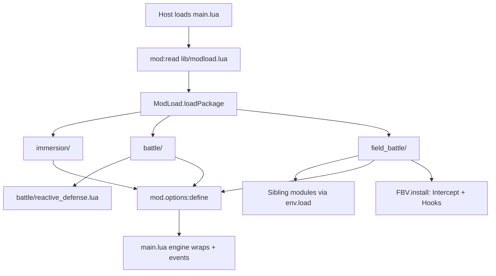
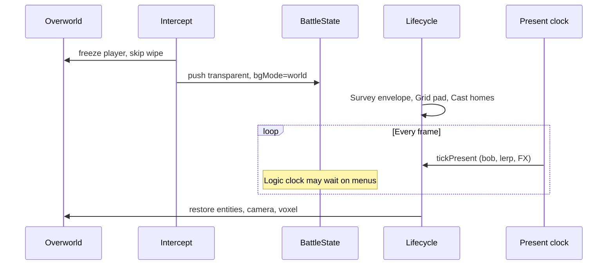
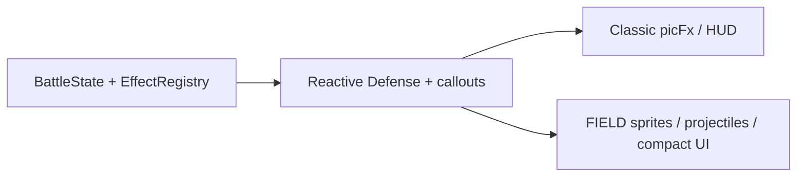

# Architecture

How **Anime Realism** is put together: boot, packages, battle logic, and FIELD
presentation. Player-facing mechanics live in `README.md`. FIELD non-negotiables
and pad math live in `field_battle/SPEC.md`. This file is the map of *who owns
what* and *what runs when*.

## What this mod is

A Gen1Recomp content mod (`manifest.json` id `anime_realism`, priority 200).
It does not replace `BattleState`. The engine still owns turns, damage rolls,
menus, Party/Bag, and faint/switch resolution. This mod:

1. Changes how fights *feel* (hide numbers, callouts, Focus reactions).
2. Optionally presents ordinary wild/trainer singles **on the live overworld**
   (FIELD) instead of the classic battle screen.

`BATTLE STAGE`:

| Value | Presentation |
|-------|----------------|
| `FIELD` | Transparent `BattleState` over the map (`field_battle/`) |
| `AUTO` | Leave other presentation mods alone; classic (or their) battle UI |

Legacy `CLASSIC` / `STADIUM` option values map to `AUTO`. This mod does not
drive Stadium / Dramaless arena models.

## Runtime constraints

The host sandbox is stricter than stock Lua:

- `require` works for **engine** modules (`src.battle.EffectRegistry`, …).
- There is often **no** `package` global and **no** `debug` library.
- Lua `io` / `love.filesystem` are not used from `main.lua` or FIELD sprites.
- Zip and loose installs both load sources through `mod:read` (host API).

Implications:

- Folder packages cannot rely on `package.loaded["coords"]` unless it exists.
  `field_battle/init.lua` temporarily aliases `require("coords")` /
  `require("themes")` while siblings load.
- HUD hiding wraps `BattleState.drawHUDs` and `HudTiles` directly. Upvalue
  patching (`debug.getupvalue`) is skipped when `debug` is missing.
- Vanilla `EffectRegistry.runDamaging` is captured from the already-required
  table, not by clearing `package.loaded`.

## Boot

`manifest.json` `entry` is `main.lua`. The host calls:

```lua
return function(mod)
```



1. `main.lua` reads `lib/modload.lua` with `mod:read`, `load`s it, and gets a
   loader bound to this `mod`.
2. `ModLoad.loadPackage("immersion"|"battle"|"field_battle")` reads
   `<dir>/init.lua`, which returns `function(env)`.
3. `env.load("file.lua")` reads siblings from that folder (works in a zip).
4. Packages `install(mod)` (FIELD actually hooks the engine here).
5. `main.lua` defines all options, then installs the remaining runtime: HUD
   filters, dialogue/callouts, Reactive Defense menus, EXP/faint feel.

Packages are exposed as `mod._arPackages` for debugging.

`./build.sh` zips `main.lua`, `manifest.json`, `LICENSE`, and the three
package trees (tests excluded) so folder paths survive import.

## Three packages

```text
anime_realism/
  main.lua              orchestrator + most runtime hooks
  lib/modload.lua       zip-safe package loader
  immersion/            option keys for numbers-feel
  battle/               option keys + Reactive Defense logic
  field_battle/         overworld presentation (extracted)
```

Ownership today is **asymmetric on purpose** (LuaJIT 200-local budget + shared
HUD table). Option keys live on packages; most *behavior* for immersion and
classic battle still runs in `main.lua`. FIELD presentation is the extracted
viewer.


| Package | Owns at runtime | Still in `main.lua` |
|---------|-----------------|---------------------|
| `immersion/` | Option keys / labels | Hide HUD/XP, generic level-up, underdog EXP, effort faint, party heal hints |
| `battle/` | `ReactiveDefense` table + option keys | REACT menu, callouts, bubbles, banter, chips, `EffectRegistry` wrap |
| `field_battle/` | Intercept, session, pad, sprites, FX, compact UI | Forwards `battle.*` into `FBV.*`; playFocusReactFx asks FBV on FIELD |

## Engine seams `main.lua` wraps

The fight systems sit on stock `BattleState` by wrapping a few engine entry
points (not by forking the battle simulator).

### Damage: `EffectRegistry.runDamaging`

`src.battle.EffectRegistry` is the engine damage pipeline, not a Stadium
package. The wrap:

1. If the player is **entrenched**, auto-hold (no REACT menu) and resume the
   original function after mitigation.
2. If a **REACT!** pick is required, stash `{ ctx, record }` on momentum state
   and return without applying damage. `finishCalloutPick` later calls the
   stored vanilla `runDamaging`.
3. If a physical **counter** opening is armed, apply the quiet DEF drop, run
   vanilla damage, maybe **Again!**.
4. Otherwise run vanilla, then trainer-foe counter / Again! mirrors.

Vanilla is stored on `EffectRegistry._arVanillaRunDamaging` so hot reload does
not chain wraps.

### Dialogue and menus

- `battle.say` / queue rows become speech bubbles (player / foe / narrator) or
  FIELD toasts.
- Anime move callouts rewrite `"NAME used MOVE!"` into trainer orders.
- REACT / COUNTER panels are extra `Menu` pages spliced into `battle.queue`
  (before the move anim when possible).
- Status / Focus chips paint on the battle overlay after callouts settle.

### HUD / numbers

- `HudTiles.drawHPBar` is a no-op; `0x6E` “Lv.” tiles are skipped.
- `BattleState.drawHUDs` is wrapped so **HIDE BATTLE HUD** can blank classic
  name/HP bands without killing the dialogue box.
- Companion UIs (Gen 3 Inspired, QoL XP bar, Dramatic Shape frosted panels)
  are gated when those mods are present. FIELD also skips their overlay hooks
  so compact chrome stays on top.

### Events

| Event | Typical work |
|-------|----------------|
| `mods.loaded` / `game.ready` | HUD wraps, FIELD install |
| `battle.started` | Clear momentum / Focus; stamp cover props only when **not** FIELD |
| `battle.move_used` | FIELD cues + projectiles; camera re-arm for Again! |
| `battle.damage_dealt` | Low-HP lines, chips |
| `battle.fainted` / `battler_switched` | FIELD recall/send-out; effort faint |
| `battle.turn_started` / `turn_ended` | Focus regen, cover/entrench clocks, FIELD turn hooks |
| `battle.ended` | Restore map overlays; FIELD teardown |

## Reactive Defense

`battle/reactive_defense.lua` is **pure logic**: Focus meter, costs, dodge
success, cover durability, brace type-call, entrench turns. No drawing, no
queue edits.

`main.lua` owns:

- When to offer **REACT!** (`ALWAYS` / `THREAT` / `OFF`).
- Menu labels and queue splicing.
- Applying the chosen action, then `dev.playFocusReactFx`.
  - FIELD: `FieldBattleViewer.react` (OW sprite + projectiles).
  - Classic: picFx hide/brace sparkles.

State is weak-keyed per `BattleState` (`byBattle` in RD, `momentumByBattle` in
main) so sessions die with the fight.

## FIELD presentation

Enabled only when `battle_stage == "FIELD"` **and** the battle is a single
wild or trainer fight (not link, demo, or double). Flags stamped on the
battle: `_arAnimeField`, `_arFieldCombat`, `_arFieldStandalone`.



### Intercept (`intercept.lua`)

Replaces the usual battle transition:

- No wipe / white return.
- Pushes **the real** `BattleState` (`isOpaque = false`, `BG_WORLD_DIM = 0`) so
  other UI mods still see `stack:top() == battle`.
- Locks the overworld player; map keeps drawing underneath.

### Lifecycle (`lifecycle.lua`)

One weak-keyed session per battle:

`Idle → Armed → Staging → Live → Finishing`

- **Survey**: read-only walkable envelope. Never writes map tiles.
- **Layout / Grid**: pad homes on the fight axis; occupancy is pad cells.
- **Cast**: trainers + mons as overworld entities with real `pose()` sprites
  (Dramatic Shape voxel crashes on nil `sprite.def`).
- **Finish**: restore entity list and camera; unlock player; spectators /
  wildlife return.

### Two clocks

The stack only updates the **top** state. Move diamond / REACT / Party freeze
`BattleState:update`. Sprites must not freeze.

| Clock | When | What |
|-------|------|------|
| Logic | Battle queue / top-state update | Turns, damage, cue *dispatch* |
| Present | Every frame while session is live | Bob, walk frames, pad lerp, FX, camera |

`Lifecycle.tickPresent` is driven from several hooks (update, overlay,
letterbox, world draw) and deduped by wall time so it does not double-step.

### Coordinates (`coords.lua`)

Three layers. **Pad is truth in Live.**

| Layer | Unit | Use |
|-------|------|-----|
| World cell | `(wx, wy)` | Survey / theme; never written |
| Pad cell | `(u, v)` | Occupancy, steps, cover |
| Pixel | `(px, py)` | Draw, bob, FX = `padToPx` + presentation offsets |

`u` is along the fight (player → foe). `v` is perpendicular (dodge / knock).
Never derive occupancy from pixels.

### FIELD module map

Loaded from `field_battle/init.lua` (plus `coords` / `themes`):

| Module | Role |
|--------|------|
| `hooks.lua` | BattleState draw/input wraps, present tick, event fan-out |
| `ui.lua` | Compact FIGHT / diamond moves / fallback dialogue (draw-only) |
| `survey.lua` | Read-only walkable envelope + water cells |
| `grid.lua` | Pad occupancy + step helpers |
| `cast.lua` | Stage trainers/mons onto pad homes |
| `cues.lua` | `arFieldCue` → step-in / cast-in-place / Dig-Fly vanish |
| `sprites.lua` | OW follower sheets via `Assets.image` / other-mod APIs |
| `projectiles.lua` | World-space move FX (not `ow.entities`) |
| `anims.lua` | Affine of classic move FX onto live pad centers |
| `audio.lua` | Cue-synced SFX; mute engine `Sound.playMove` while live |
| `arena.lua` / `themes.lua` | Session overlay props (trees/rocks/grass), not tile edits |
| `layout.lua` | Tight adjacent-mon formation |
| `spectators.lua` | Nearby trainers walk in and watch |
| `wildlife.lua` | Roaming OW mons scatter |
| `compat.lua` | Gate Dramatic Shape *staging*; keep free-roam VOXEL drawing |
| `debug.lua` | Optional pad occupancy overlay |

Also in the tree: `arenas/*.lua` (hand-crafted kit data), `callouts.lua`
(world-anchored trainer bubbles; not loaded by `init.lua` yet), `logger.lua`,
`tests/`.

### Sprite resolution

`sprites.lua` does not open files. It asks:

1. Wilds of Kanto `resolveFollowerSprite` / `assetPath` when those mods exist.
2. Other follower packs’ handles (`path` / `root`) and `Assets.image`.
3. `love.graphics.newImage` as a last loader.

`FIELD SPRITES` (`AUTO` / `GSC` / `HGSS` / `POKEDEX`) picks the sheet family.
Water-types can swap to a swim sheet on surveyed water cells.

### Compact UI vs engine UI

`BattleState` still owns phases, cursors, and input. FIELD paints a small
command menu and U/R/L/D move diamond, then injects **A** for instant cast.
**B** pauses back to FIGHT/PKMN/ITEM/RUN. Classic anim paint is
suppressed; engine anim *rows* still advance for timing. HP is a tiny bar
over each mon (world→UI mapped). Party/Bag stay engine screens.

## Classic vs FIELD (same fight systems)



Callouts, Focus, bubbles, chips, underdog EXP, and effort faint run in both
modes. FIELD only replaces **where** battlers and FX appear.

## Companion mods

Optional (`manifest.json`):

- **Dramatic Shape** — voxel overworld under FIELD; staging is gated so it
  cannot drop a 3D arena on a map fight.
- **Battle Cinematics** — Again! / extra swings re-emit `battle.move_used`.
- **PokePCFollowers / FOLLOWERS_EX / Wilds** — FIELD battler art.
- **quality_of_life / gen3_battle_ui** — HUD/XP/dialogue overrides when FIELD
  is off; skipped while compact FIELD UI is active.

This mod does not depend on StadiumBattleFX or Dramaless Shape.

## Where to change things

| You want to… | Start here |
|--------------|------------|
| Focus costs / dodge math | `battle/reactive_defense.lua` |
| REACT menu / queue timing | `main.lua` (`queueCalloutPickMenu`, `finishCalloutPick`, `EffectRegistry.runDamaging`) |
| Hide numbers / EXP feel | `main.lua` HUD + `battle.started` EXP hooks; keys in `immersion/` |
| FIELD intercept / no wipe | `field_battle/intercept.lua` |
| Pad steps / Dig-Fly | `field_battle/cues.lua` + `grid.lua` |
| Move VFX | `field_battle/projectiles.lua` |
| Compact menus | `field_battle/ui.lua` + input in `hooks.lua` |
| Follower art | `field_battle/sprites.lua` |
| Session begin/end | `field_battle/lifecycle.lua` |
| Zip contents | `build.sh` |
