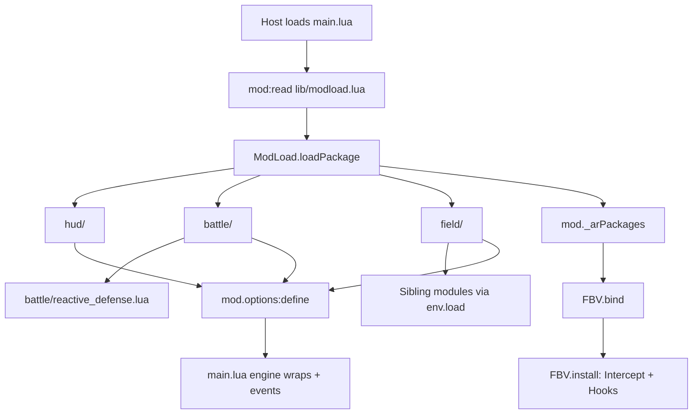
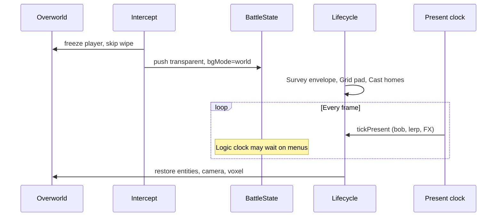
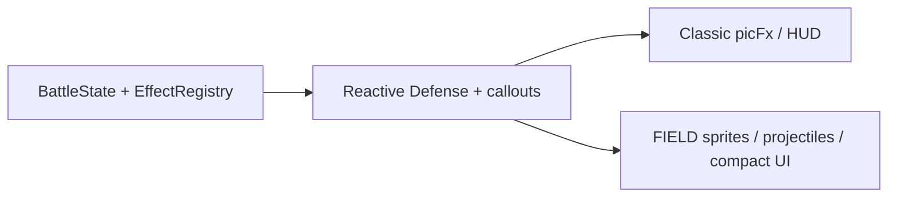
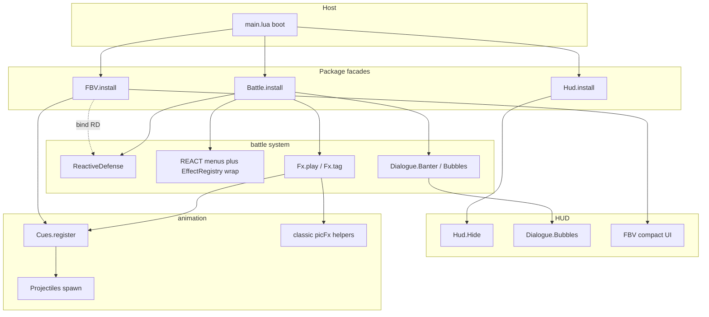

# Architecture

How **Anime Realism** is put together: boot, packages, battle logic, and FIELD
presentation. Player-facing mechanics live in `README.md`. FIELD non-negotiables
and pad math live in `field/SPEC.md`. This file is the map of *who owns
what* and *what runs when*.

## What this mod is

A Gen1Recomp content mod (`manifest.json` id `anime_realism`, priority 200).
It does not replace `BattleState`. The engine still owns turns, damage rolls,
menus, Party/Bag, and faint/switch resolution. This mod:

1. Changes how fights *feel* (hide numbers, callouts, Focus reactions).
2. Optionally presents ordinary wild/trainer singles **on the live overworld**
   (FIELD) instead of the classic battle screen.

`BATTLE STAGE`:

| Value | Presentation |
|-------|----------------|
| `FIELD` | Transparent `BattleState` over the map (`field/`) |
| `AUTO` | Leave other presentation mods alone; classic (or their) battle UI |

Legacy `CLASSIC` maps to `AUTO`. Legacy `STADIUM` maps to `FIELD` (stadium
presentation is gone; those saves keep map fights). This mod does not
drive Stadium / Dramaless arena models.

## Runtime constraints

The host sandbox is stricter than stock Lua:

- `require` works for **engine** modules (`src.battle.EffectRegistry`, …).
- There is often **no** `package` global and **no** `debug` library.
- Lua `io` / `love.filesystem` are not used from `main.lua` or FIELD sprites.
- Zip and loose installs both load sources through `mod:read` (host API).

Implications:

- Folder packages cannot rely on `package.loaded["coords"]` unless it exists.
  `field/init.lua` temporarily aliases `require("coords")` /
  `require("themes")` / `require("fx_catalog")` while siblings load.
- HUD hiding wraps `BattleState.drawHUDs` and `HudTiles` directly. Upvalue
  patching (`debug.getupvalue`) is skipped when `debug` is missing.
- Vanilla `EffectRegistry.runDamaging` is captured from the already-required
  table, not by clearing `package.loaded`.

## Boot

`manifest.json` `entry` is `main.lua`. The host calls:

```lua
return function(mod)
```



1. `main.lua` reads `lib/modload.lua` with `mod:read`, `load`s it, and gets a
   loader bound to this `mod`.
2. `ModLoad.loadPackage("hud"|"battle"|"field")` reads
   `<dir>/init.lua`, which returns `function(env)`.
3. `env.load("file.lua")` reads siblings from that folder (works in a zip).
4. `mod._arPackages` is set, then `FBV.bind` injects `ReactiveDefense` into
   FIELD, then packages `install(mod)` (FIELD actually hooks the engine here).
5. `main.lua` defines all options, then installs the remaining runtime: HUD
   filters, dialogue/callouts, Reactive Defense menus, EXP/faint feel.

Packages are exposed as `mod._arPackages` for debug and for `FBV.bind`.

`./build.sh` zips `main.lua`, `manifest.json`, `LICENSE`, and the three
package trees (tests excluded) so folder paths survive import.

## Three packages

```text
anime_realism/
  main.lua              orchestrator + host callbacks + classic picFx helpers
  lib/modload.lua       zip-safe package loader
  hud/                 hide numbers + EXP/effort rewards
  battle/              rules (RD) + REACT menus + FX policy + dialogue
  field/               overworld presentation (cues, projectiles, compact HUD)
```

Ownership is layered so each fight system has one home. `main.lua` still owns
send/idle banter enqueue and classic picFx queue helpers (LuaJIT 200-local
budget). Target facades, who may call whom, and remaining extracts live in
[Composable APIs](#composable-apis).


| Package | Owns at runtime | Still in `main.lua` |
|---------|-----------------|---------------------|
| `hud/` | `Hide.install` (levels/HP/XP) + `Rewards.install` | Overlay hook that *calls* bubble paint |
| `battle/` | `ReactiveDefense` + `React` + `Fx` + `Dialogue` + `Strings` | Send/idle banter enqueue; `React.bind` / `Fx.bind` / `Dialogue.bind` host callbacks |
| `field/` | Intercept, session, pad cues (`Cues.register`), sprites, FX catalog, compact UI, style painters, hand arenas | Forwards `battle.*` into `FBV.*` |

## Engine seams `main.lua` wraps

The fight systems sit on stock `BattleState` by wrapping a few engine entry
points (not by forking the battle simulator).

### Damage: `EffectRegistry.runDamaging`

`src.battle.EffectRegistry` is the engine damage pipeline, not a Stadium
package. The wrap:

1. If the player is **entrenched**, auto-hold (no REACT menu) and resume the
   original function after mitigation.
2. If a **REACT!** pick is required, stash `{ ctx, record }` on momentum state
   and return without applying damage. `finishCalloutPick` later calls the
   stored vanilla `runDamaging`.
3. If a physical **counter** opening is armed, apply the quiet DEF drop, run
   vanilla damage, maybe **Again!**.
4. Otherwise run vanilla, then trainer-foe counter / Again! mirrors.

Vanilla is stored on `EffectRegistry._arVanillaRunDamaging` so hot reload does
not chain wraps.

### Dialogue and menus

- `battle.say` / queue rows become speech bubbles (player / foe / narrator) or
  FIELD toasts.
- Anime move callouts rewrite `"NAME used MOVE!"` into trainer orders.
- REACT / COUNTER panels are extra `Menu` pages spliced into `battle.queue`
  (before the move anim when possible).

### HUD / numbers

- `HudTiles.drawHPBar` is a no-op; `0x6E` “Lv.” tiles are skipped.
- `BattleState.drawHUDs` is wrapped so **HIDE BATTLE HUD** can blank classic
  name/HP bands without killing the dialogue box.
- Companion UIs (Gen 3 Inspired, QoL XP bar, Dramatic Shape frosted panels)
  are gated when those mods are present. FIELD also skips their overlay hooks
  so compact chrome stays on top.

### Events

| Event | Typical work |
|-------|----------------|
| `mods.loaded` / `game.ready` | HUD wraps, FIELD install |
| `battle.started` | Clear momentum / Focus |
| `battle.move_used` | FIELD cues + projectiles; camera re-arm for Again! |
| `battle.damage_dealt` | Low-HP lines |
| `battle.fainted` / `battler_switched` | FIELD recall/send-out; effort faint |
| `battle.turn_started` / `turn_ended` | Focus regen, cover/entrench clocks, FIELD turn hooks |
| `battle.ended` | FIELD teardown |

## Reactive Defense

`battle/reactive_defense.lua` is **pure logic**: Focus meter, costs, dodge
success, cover durability, brace type-call, entrench turns. No drawing, no
queue edits.

`main.lua` owns:

- When to offer **REACT!** (`ALWAYS` / `THREAT` / `OFF`) is read by `battle/react.lua` via `React.bind`.
- Dialogue rewrite, say wraps, send/idle banter enqueue, and classic dodge/brace sparkles.
  Bubble paint and trainer cameo live in `battle/dialogue.lua`.
- Applying presentation after a pick (`dev.playFocusReactFx`).
  - FIELD: `FieldBattleViewer.react` (OW sprite + projectiles).
  - Classic: picFx hide/brace sparkles.

`battle/react.lua` owns momentum state, the REACT / COUNTER pick modals, and the
`EffectRegistry.runDamaging` wrap. It calls `ReactiveDefense.resolveIncoming`
then host callbacks for FX and queue text.

State is weak-keyed per `BattleState` (`byBattle` in RD, `momentumByBattle` in
main) so sessions die with the fight.

## FIELD presentation

Enabled only when `battle_stage == "FIELD"` **and** the battle is a single
wild or trainer fight (not link, demo, or double). Flags stamped on the
battle: `_arAnimeField`, `_arFieldCombat`, `_arFieldStandalone`.



### Intercept (`intercept.lua`)

Replaces the usual battle transition:

- No wipe / white return.
- Pushes **the real** `BattleState` (`isOpaque = false`, `BG_WORLD_DIM = 0`) so
  other UI mods still see `stack:top() == battle`.
- Locks the overworld player; map keeps drawing underneath.

### Lifecycle (`lifecycle.lua`)

One weak-keyed session per battle:

`Idle → Armed → Staging → Live → Finishing`

- **Survey**: read-only walkable envelope. Never writes map tiles.
- **Layout / Grid**: pad homes on the fight axis; occupancy is pad cells.
- **Cast**: trainers + mons as overworld entities with real `pose()` sprites
  (Dramatic Shape voxel crashes on nil `sprite.def`).
- **Finish**: restore entity list and camera; unlock player; spectators /
  wildlife return.

### Two clocks

The stack only updates the **top** state. Move diamond / REACT / Party freeze
`BattleState:update`. Sprites must not freeze.

| Clock | When | What |
|-------|------|------|
| Logic | Battle queue / top-state update | Turns, damage, cue *dispatch* |
| Present | Every frame while session is live | Bob, walk frames, pad lerp, FX, camera |

`Lifecycle.tickPresent` is driven from several hooks (update, overlay,
letterbox, world draw) and deduped by wall time so it does not double-step.

### Coordinates (`coords.lua`)

Three layers. **Pad is truth in Live.**

| Layer | Unit | Use |
|-------|------|-----|
| World cell | `(wx, wy)` | Survey / theme; never written |
| Pad cell | `(u, v)` | Occupancy, steps, cover |
| Pixel | `(px, py)` | Draw, bob, FX = `padToPx` + presentation offsets |

`u` is along the fight (player → foe). `v` is perpendicular (dodge / knock).
Never derive occupancy from pixels.

### FIELD module map

Loaded from `field/init.lua`. Sibling `require("coords")` / `require("themes")` /
`require("fx_catalog")` is shimmed while the tree loads.

| Folder | Files | Role |
|--------|-------|------|
| `pad/` | `coords`, `grid`, `layout`, `survey`, `cast` | Pad space, occupancy, staging |
| `session/` | `lifecycle`, `intercept`, `compat`, `spectators`, `wildlife` | Begin/end, stack host, world extras |
| `fx/` | `fx_catalog`, `projectiles`, `cues`, `anims`, `audio`, `sprites` | Move VFX, pad cues, battler sheets |
| `stage/` | `arena`, `themes`, `arenas/*.lua` | Overlay props; hand kits when pad size matches |
| `chrome/` | `ui`, `callouts`, `debug`, `hooks*` | Compact menus, bubbles, BattleState wraps |

Also in the tree: `logger.lua` (unused; do not wire or delete yet), `tests/`.

### Sprite resolution

`sprites.lua` does not open files. It asks:

1. Wilds of Kanto `resolveFollowerSprite` / `assetPath` when those mods exist.
2. Other follower packs’ handles (`path` / `root`) and `Assets.image`.
3. `love.graphics.newImage` as a last loader.

`FIELD SPRITES` (`AUTO` / `GSC` / `HGSS` / `POKEDEX`) picks the sheet family.
Water-types can swap to a swim sheet on surveyed water cells.

### Compact UI vs engine UI

`BattleState` still owns phases, cursors, and input. FIELD paints a small
command menu and U/R/L/D move diamond, then injects **A** for instant cast.
**B** pauses back to FIGHT/PKMN/ITEM/RUN. Classic anim paint is
suppressed; engine anim *rows* still advance for timing. HP is a tiny bar
over each mon (world→UI mapped). Party/Bag stay engine screens.

## Classic vs FIELD (same fight systems)



Callouts, Focus, bubbles, underdog EXP, and effort faint run in both
modes. FIELD only replaces **where** battlers and FX appear.

## Companion mods

Optional (`manifest.json`):

- **Dramatic Shape** — voxel overworld under FIELD; staging is gated so it
  cannot drop a 3D arena on a map fight.
- **Battle Cinematics** — Again! / extra swings re-emit `battle.move_used`.
- **PokePCFollowers / FOLLOWERS_EX / Wilds** — FIELD battler art.
- **quality_of_life / gen3_battle_ui** — HUD/XP/dialogue overrides when FIELD
  is off; skipped while compact FIELD UI is active.

This mod does not depend on StadiumBattleFX or Dramaless Shape.

## Composable APIs

Packages plug into three layers. `main.lua` still owns send/idle banter enqueue
and classic picFx queue builders. New work should plug into the contracts
below instead of growing god-functions (`Cues.apply` dispatch,
`Projectiles.move` / `drawEffect`, `Hooks.install`).



### Three layers

**1. Package facades** (what `main.lua` may call)

| Package | Public now | Public target |
|---------|------------|---------------|
| `hud/` | `Rewards.install` + `Hide.install` (after `Hide.bind`) | Overlay still *calls* bubble paint |
| `battle/` | `ReactiveDefense` + `React` + `Fx` + `Dialogue` + `Strings` + option keys | `React.bind` / `Fx.bind` / `Dialogue.bind` host callbacks; `RD` stays pure |
| `field/` | `FBV` facade plus session/react/draw; submodules stay internal | Hooks talks to facade methods, not `FBV.Cues.*` / `FBV.Lifecycle.*` |

**2. Internal composers** (only these may wire siblings)

- `Lifecycle` is the FIELD composer. It receives a `deps` bag and is the only
  module allowed to orchestrate Survey / Layout / Grid / Cast / Cues /
  Projectiles / Arena / Spectators / Wildlife.
- `Battle.install` is the classic-fight composer (menus, damage wrap,
  dialogue). It may call `RD.*` and `FBV.react` / `FBV.isFieldBattle` — not
  FIELD internals.
- `Hooks.install` is a composer: predicates stay in `chrome/hooks.lua`; wrap
  groups live in `chrome/hooks_draw.lua` / `hooks_input.lua` / `hooks_events.lua`.
  Those talk only to the FBV facade (not `FBV.Lifecycle.*` / `FBV.Cues.*`).

**3. Registries** (how FIELD scales later)

Add a move, cue, or kit without editing the god `if kind ==` / `drawEffect`
switches:

- **Cue kinds** — `Cues.register(kind, handler)` behind the existing
  `Cues.apply(session, side, kind, Grid, nudgeCamera, battle, opts)` entry.
  Built-in dodge/cover/brace/attack/hit/faint/… handlers register at load.
  Tests already depend on that signature.
- **Move FX** — `field/fx/fx_catalog.lua` holds `MOVE_FX` + `TYPE_COLORS` +
  type defaults. `Projectiles.move` / `contact` / `status` stay the spawn API.
  Style painters register by name (`Projectiles.registerStyle`);
  `drawEffect` dispatches `STYLE_PAINTERS[p.style]`.
- **Arena kits** — `field/stage/arenas/*.lua` register via `Themes.registerLayout`.
  `Themes.kit` attaches the hand layout when present. `Arena.generate` uses
  it only when pad `sizeU`/`sizeV` match the file (authored 10×5); tight
  wild pads stay procedural.

### Public contracts

**`FBV` — presentation policy + session**

Callers (`main.lua`, later `battle/`):

- `enabled(mod)` / `supportsBattle(battle)` / `shouldUse(mod, battle)` — policy
- `isFieldBattle(battle)` — runtime: flags `_arAnimeField|_arFieldCombat|_arFieldStandalone` **or** `shouldUse`. Flags remain a cache stamped by intercept/lifecycle; they are not the public API.
- `session` / `react` / `drawUI` / `drawCallouts` / `compactUIActive` / `install`
- `bind(packages)` — inject `ReactiveDefense` (and later other cross-package services)

`compactUIActive` (and `hud.fieldCompactActive` in `main.lua`) is the **draw**
gate. It answers a different question than `isFieldBattle`.

Do **not** grow `main.lua` reads of `FBV.Cues`, `FBV.Lifecycle`, or raw
`session` fields. If cover flavor is needed, add `FBV.cover(battle)` rather
than digging the session.

**`ReactiveDefense` (`RD`) — pure rules**

`battle/reactive_defense.lua`: `state` / `sideState` / `resolveIncoming` /
`menuActions` / `endTurn` / `applyCoverHit` / tunables. No drawing, no queue
edits, no `require` of FIELD.

FIELD receives `RD` via `deps.ReactiveDefense` after `FBV.bind`, not via
`mod._arPackages` peeks.

**`Cues.apply` / `Projectiles.{move,contact,status,tick,drawUi}` / `Cast.stage*`**

Stable for `field/tests/run_grid_tests.lua` (`loadfile` + partial
`session._deps`). Registry work later must keep these entry points.

### Who may call whom

| Caller | May call | Must not call |
|--------|----------|---------------|
| `main.lua` | `Hud.install`, `Battle.install`, `FBV` facade, `RD.*` (until Battle.install owns REACT) | FIELD submodules, `session` guts |
| `battle/` | `RD.*`, `FBV.react`, `FBV.isFieldBattle` | `FBV.Cues`, `FBV.Lifecycle`, `session._deps` |
| `Lifecycle` | anything on the `deps` bag | `mod._arPackages` |
| `Cues` / `Projectiles` | Grid / spawn APIs passed in or on `session._deps` until registries land | `Lifecycle`, `RD` |
| `Hooks` | FBV facade | `mod._arPackages` |

### Hard constraints

Do not “fix” these by rewriting:

- Zip-safe `lib/modload.lua` (`env.load` siblings; no relying on
  `package.loaded` except the coords/themes/fx_catalog shim).
- LuaJIT **200-local** budget: extracted code stays on packed tables (`dev`,
  `hud`, `S`, `BanterCameo` alias), not a flood of new locals in
  `return function(mod)`.
- `EffectRegistry._arVanillaRunDamaging` capture (hot-reload must not chain wraps).
- `FBV.install` stays idempotent (`_arFbv*` guards); multiple `mods.loaded` /
  `game.ready` calls remain valid.
- Pad-is-truth rules in `field/SPEC.md` stay non-negotiable.

### Extraction sequence

1. **Facades + wiring** — done: one boot path, `FBV.bind`, `FBV.isFieldBattle`.
2. **REACT pipeline → `battle/`** — done: `battle/react.lua` owns momentum, pick
   menus, and the `EffectRegistry.runDamaging` wrap.
3. **HUD / EXP / effort → `hud/`** — done: `hud/rewards.lua` +
   `hud/hide.lua`. Overlay still *calls* bubble paint from `main.lua`.
4. **FIELD registries** — done: `fx_catalog.lua` + `Cues.register` +
   `Projectiles.registerStyle` + `Themes.registerLayout` / `stage/arenas/*.lua`.
5. **Split god-files behind those registries** — done: `Hooks.install` composer
   plus `chrome/hooks_draw.lua` / `hooks_input.lua` / `hooks_events.lua`. Public
   signatures unchanged.
6. **Narrow FBV** — done for Hooks: facade methods (`tryMouseLook`,
   `vanishKind`, `shouldHoldEngineHit`, `holdCloseHit`, `tagSelfDamage`, …).
   Raw `FBV.Cues` / `FBV.Lifecycle` remain on the table for tests / internals;
   `main.lua` must not grow reads of them.
7. **Dialogue extract** — done: `battle/strings.lua` owns `S`; `Dialogue`
   owns rewrite helpers and `wrapBattleSay`. Still in `main.lua`: send/idle
   banter enqueue, classic picFx queue helpers, `fitsBattleLine`.

## Where to change things

| You want to… | Start here |
|--------------|------------|
| Focus costs / dodge math | `battle/reactive_defense.lua` |
| REACT menu / queue timing | `battle/react.lua` (`React.install`; host callbacks still in `main.lua`) |
| Hide numbers / EXP feel | `hud/hide.lua` + `hud/rewards.lua` |
| Speech bubbles / trainer cameo | `battle/dialogue.lua` + `battle/strings.lua` (`Dialogue.bind`) |
| Focus react animation | `battle/fx.lua` (policy) then classic helpers in `main.lua` or `Cues.register` |
| FIELD intercept / no wipe | `field/session/intercept.lua` |
| Pad steps / Dig-Fly | `field/fx/cues.lua` (`Cues.register`) + `field/pad/grid.lua` |
| Move VFX | `field/fx/fx_catalog.lua` then `Projectiles.registerStyle` |
| Compact menus | `field/chrome/ui.lua` + input in `chrome/hooks_input.lua` |
| Follower art | `field/fx/sprites.lua` |
| Session begin/end | `field/session/lifecycle.lua` |
| Zip contents | `build.sh` |
